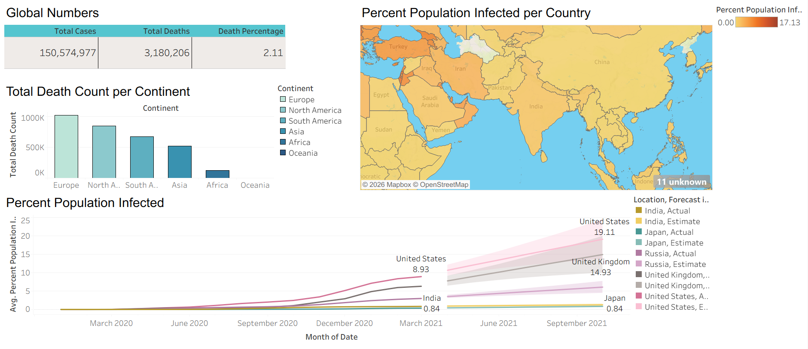
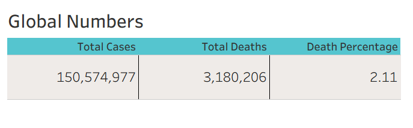
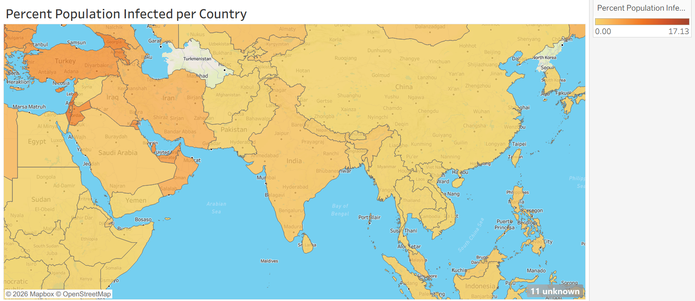
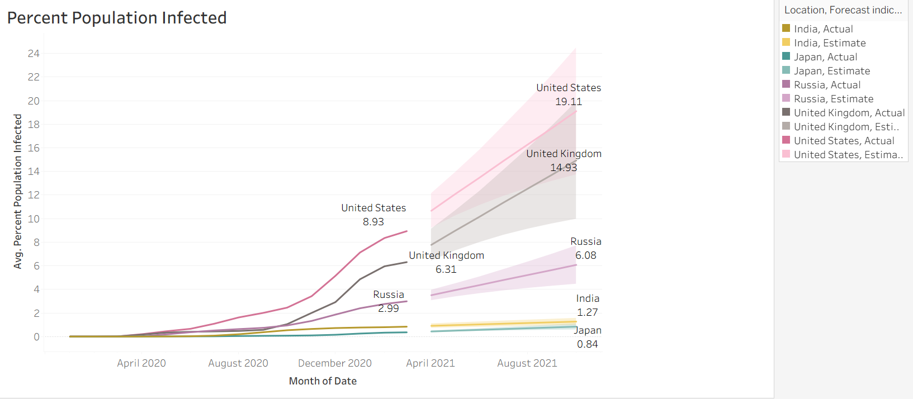

# COVID-19 Data Analysis using SQL & Tableau

## Project Overview

This project analyses global COVID-19 data using SQL and Tableau to uncover trends in infection rates, death counts, and population impacts across countries and continents.

The project demonstrates the complete data analytics workflow, including data cleaning, exploratory data analysis (EDA), SQL querying, and dashboard development.

---

## Project Objectives

- Analyse global COVID-19 case trends.
- Identify countries with the highest infection rates.
- Compare death counts across continents.
- Calculate infection and death percentages.
- Build an interactive Tableau dashboard.
- Generate actionable insights from real-world data.

---

## Tools Used

- SQL Server
- Tableau
- Microsoft Excel
- GitHub

---

## Dataset Information

### CovidDeaths Dataset

Contains:

- Country/Location
- Date
- Population
- Total Cases
- New Cases
- Total Deaths
- New Deaths

### CovidVaccinations Dataset

Contains:

- Country/Location
- Date
- New Vaccinations
- Total Vaccinations

---

## Project Workflow

### Data Cleaning

- Imported datasets into SQL Server.
- Checked for null values.
- Converted date columns to proper formats.
- Removed unnecessary records.
- Standardised country names.
- Verified data integrity before analysis.

### Exploratory Data Analysis (EDA)

Analysis performed:

- Total Cases vs Total Deaths
- Total Cases vs Population
- Countries with the Highest Infection Rate
- Countries with the Highest Death Count
- Continent-wise Death Analysis
- Global Statistics
- Vaccination Progress Analysis

### Dashboard Development

Created an interactive Tableau dashboard featuring:

- Global COVID-19 KPIs
- Death Count by Continent
- Infection Rate by Country
- Geographic Analysis
- Trend Analysis Over Time

---

## SQL Concepts Used

- Aggregate Functions
- GROUP BY
- ORDER BY
- Joins
- Common Table Expressions (CTEs)
- Window Functions
- Views

---

## Dashboard Preview

### Dashboard Overview



### KPI Summary



### Geographic Analysis



### Global Cases Analysis



---

## Key Insights

- Europe recorded the highest cumulative death count.
- Infection rates varied significantly across countries.
- Population size influenced total cases and deaths.
- Multiple waves of COVID-19 infections were observed globally.
- Vaccination programs expanded rapidly across many regions.

---

## Repository Structure

```text
COVID-19-Data-Analysis/
│
├── Data/
│   ├── CovidDeaths.xlsx
│   ├── CovidVaccinations.xlsx
│   └── Data_Dictionary.md
│
├── SQL/
│   ├── Covid_Exploration.sql
│   ├── Tableau_Visualization_Queries.sql
│   └── SQL_Insights.md
│
├── Dashboard/
│   ├── Covid Dashboard Analysis.twbx
│   └── Dashboard_Notes.md
│
├── Images/
│   ├── dashboard_overview.png
│   ├── key_metrics.png
│   ├── geographic_analysis.png
│   └── infection_trend_analysis.png
│
├── Documentation/
│   ├── Project_Objective.md
│   ├── Data_Cleaning_Process.md
│   ├── Exploratory_Data_Analysis.md
│   └── Business_Insights.md
│
└── README.md
```

---

## Business Value

This project demonstrates how data analytics can be used to:

- Monitor global health trends.
- Identify high-risk regions.
- Support data-driven decision-making.
- Visualize complex datasets effectively.
- Generate meaningful insights from raw data.

---

## About This Project

This project was created as part of a Data Analytics portfolio to demonstrate proficiency in:

- SQL Data Analysis
- Data Cleaning
- Exploratory Data Analysis
- Tableau Dashboard Development
- Business Insight Generation

---

## Author

**Harshit Kaishwar**

Aspiring Data Analyst

LinkedIn: [www.linkedin.com/in/harshit-kaishwar-7286112b9]


